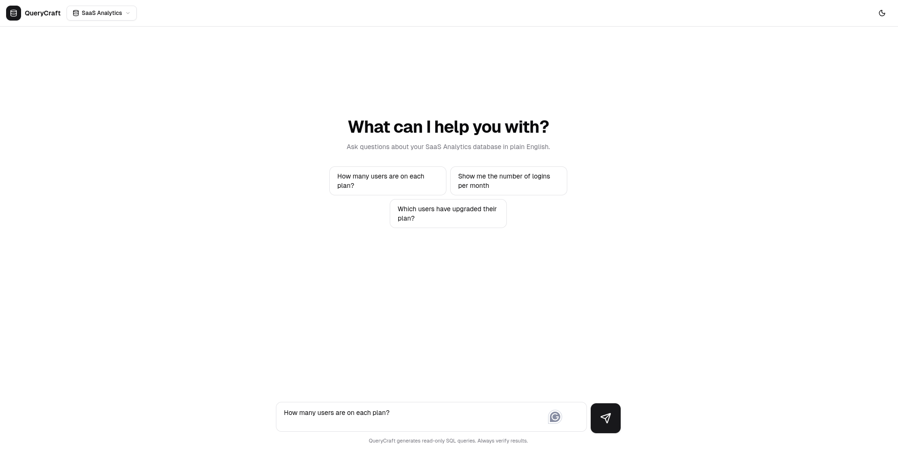

##SQLgpt

A natural-language to SQL query tool. Ask questions about your data in plain English and get instant results with visualizations.

Built with Next.js, Gemini AI, and Supabase.


## Features

- **Natural Language Queries** — Type questions in plain English and get accurate SQL generated by Gemini 2.5 Flash.
- **Live Query Execution** — Generated SQL runs against a live Supabase PostgreSQL database with results displayed instantly.
- **Smart Visualizations** — Results are rendered as bar charts, line charts, or tables based on query intent (powered by Recharts).
- **Multiple Schemas** — Choose from pre-loaded database schemas: E-Commerce, SaaS Analytics, and HR & Operations.
- **Dark / Light Mode** — Toggle between themes with `next-themes`.
- **Chat Interface** — Conversational UI with message history and a "New Chat" reset.

## Tech Stack

| Layer       | Technology                          |
| ----------- | ----------------------------------- |
| Framework   | Next.js 14 (App Router)             |
| AI          | Gemini 2.5 Flash via Vercel AI SDK  |
| Database    | Supabase (PostgreSQL)               |
| Charts      | Recharts                            |
| UI          | shadcn/ui, Radix, Tailwind CSS      |
| Validation  | Zod                                 |

## Getting Started

### Prerequisites

- Node.js 18+
- A [Google AI Studio](https://aistudio.google.com/apikey) API key
- A [Supabase](https://supabase.com) project with seed data

### Setup

1. **Clone the repo**

   ```bash
   git clone https://github.com/upendrapant/query-craft.git
   cd query-craft
   ```

2. **Install dependencies**

   ```bash
   npm install
   ```

3. **Configure environment variables**

   Create a `.env.local` file in the project root:

   ```env
   GOOGLE_GENERATIVE_AI_API_KEY=your_gemini_api_key
   NEXT_PUBLIC_SUPABASE_URL=your_supabase_url
   NEXT_PUBLIC_SUPABASE_ANON_KEY=your_supabase_anon_key
   SUPABASE_SERVICE_ROLE_KEY=your_supabase_service_role_key
   ```

4. **Run the dev server**

   ```bash
   npm run dev
   ```

   Open [http://localhost:3000](http://localhost:3000).

## Usage

1. Select a database schema from the dropdown in the header.
2. Type a question or click a suggested query.
3. View the generated SQL, explanation, and results as a chart or table.

## License

MIT
